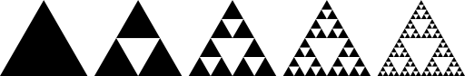

## Druhá iterace

Cvičení zaměřené na definici vlastních konstruktorů a jejich přetěžování.

1.  Ve třídě `Vertex2D`:
    *   Třída bude mít definovaný konstruktor o dvou parametrech `x` a `y`.
    *   Udělejte třídu `Vertex2D` neměnnou (*immutable*) tím, že odstraníte settery a změníte metodu `move`.
        Metoda `move` bude mít návratový typ `Vertex2D` a bude vracet nový vrchol.
    *   Přidejte metodu `double distance(Vertex2D vertex)`, která vezme jiný 2D bod jako vstupní parametr a vrátí
        jeho eukleidovskou vzdálenost. Vzdálenost bodů se vypočítá jako:
    
    *   Pokud je vstupní argument `null`, pak metoda vrátí hodnotu `-1.0` jako indikátor chyby
    (vzdálenost je vždy >= 0).

    > V Javě se odmocnina vypočítá pomocí statické metody `Math.sqrt()`.

2.  Vytvořte třídu `Circle`.
    *   Třída bude mít konstruktor se dvěma parametry (v tomto pořadí): _střed_ typu `Vertex2D` a _poloměr_ typu `double`.
        Atributy budou neměnné.
    *   Třída bude mít dále *bezparametrický konstruktor*, který vytvoří jednotkovou kružnici se středem
        v počátku souřadného systému (střed `[0, 0]`, poloměr `1`).
    *   **Bezparametrický konstruktor bude volat předchozí konstruktor** s parametry a předá mu potřebné hodnoty.
    *   Pro poloměr a střed vygenerujte gettery `getRadius()` a `getCenter()`.
    *   Metoda `toString` bude vracet řetězec ve formátu:

            "Circle: center=[<x>, <y>], radius=<radius>"

        kde `<x>` a `<y>` jsou hodnoty příslušných souřadnic středu a `<radius>` je hodnota poloměru.

3.  Upravte třídu `Triangle` následujícím způsobem:
    *   Konstruktor bude mít *3 parametry* typu `Vertex2D`.
    *   Udělejte třídu neměnnou tím, že odstraníte metodu set.
    *   Přidejte metodu `boolean isEquilateral()`, která vrátí `true`, jestliže je trojúhelník rovnostranný.
        Protože pracujeme s reálnými čísly, nelze jednoduše porovnávat délky stran pomocí `d1 == d2`.
        Je nutné použít test, který bude považovat dvě reálná čísla za shodná, pokud se liší jen málo:

            Math.abs(d1-d2) < 0.001

        kde `0.001` je tolerovaná absolutní odchylka.
    *   Vytvořte přetíženou metodu `boolean divide(int depth)`, která rozdělí trojúhelník na podtrojúhelníky.
        Výsledkem bude [_Sierpińského trojúhelník_](http://en.wikipedia.org/wiki/Sierpinski_triangle):
             
             *Sierpińského trojúhelníky hloubky 0 až 4.*
        *   Parametr `depth` udává hloubku dělení. Nula značí žádné dělení (jsme na konci rekurze), 1 znamená,
            že dojde k jednomu rozdělení původního trojúhelníka, atd.
        *   Jestli je `depth` nula, rekurze se ukončí vrácením `false` (trojúhelník na úrovni nula je již rozdělen).
        *   Záporná hodnota je považována za chybu, kterou metoda indikuje tím, že vrátí `false`.
        *   Metoda použije existující metodu `divide()`, a pak zavolá `divide(int depth)` na svých podtrojúhelnících
            s parametrem `depth` o jedna nižší a pak vrátí `true`.

4.  Upravte třídu `Demo` tak, aby šla zkompilovat.

5.  Po spuštění třídy `Draw` se na obrazovce vykreslí *Sierpińského trojúhelníky* hloubky 4 a kolem něho červená kružnice.
